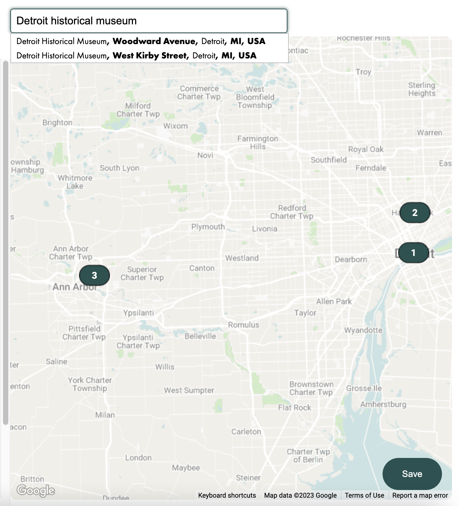
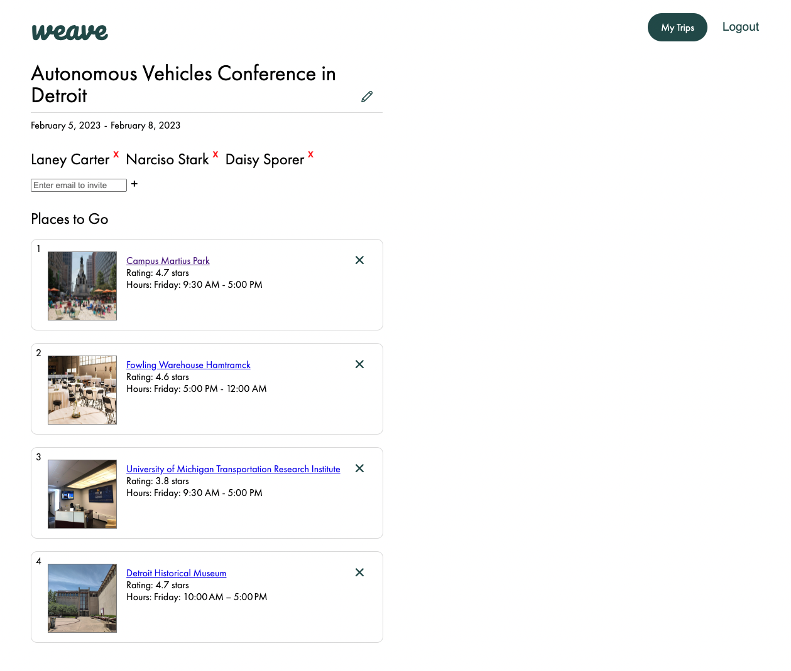
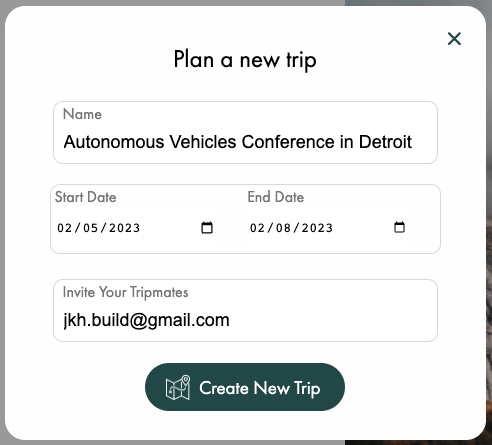
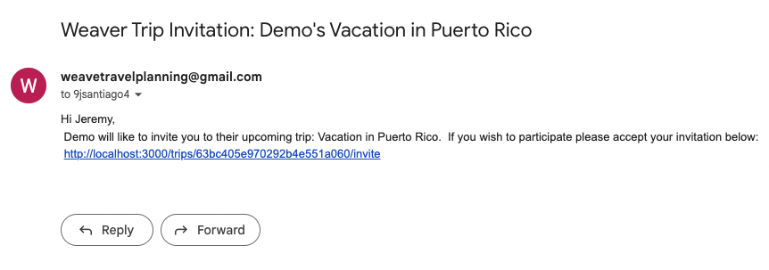

# Welcome to Weave

[Click Here](https://weave.onrender.com) for the live site.

## Introduction

Weave is a travel planning tool for friends and solo adventurers to plan their next journey.
 
Create a trip and add busineses and POI's to your itinerary:

- Languages: Javascript, HTML, and CSS.
- Frontend: React-Redux
- Backend: Express, Node.js
- Database: MongoDB/Mongoose
- Hosting: Render
- Misc: Google Maps, Google Places / Autocomplete, Google Geocoding API's, Nodemailer Module

## Google Maps, Places / Autocomplete, Geocoding API's

Weave users can search businesses and POI's from google places and pin them onto a map
 

 
Trip itinerary items are updated with relavant business information
 

## Nodemailer.js

Weave users can create trips and invite friends to view itinerary items.

  

 
Users invited need to accept invites sent to their emails.
 

  

